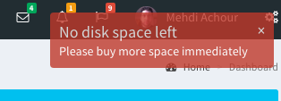

About
=====

This is a notifications module for your Yii 2 powered application.

Installation
------------

The preferred way to install this extension is through [composer](http://getcomposer.org/download/).

Either run

```
php composer.phar require --prefer-dist machour/yii2-notifications "@dev"
```

or add

```
"machour/yii2-notifications": "@dev"
```

to the require section of your `composer.json` file.


Configuration
-------------

Before using this module, you have to run its migrations scripts:

```
./yii migrate/up --migrationPath=vendor/machour/yii2-notifications/migrations/
```

You also need to enable the module in Yii `modules` section of the configuration file:
```php
return [
    // ...
    'modules' => [
        'notifications' => [
            'class' => 'machour\yii2\notifications\NotificationsModule',
            // Point this to your own Notification class
            // See the "Declaring your notifications" section below
            'notificationClass' => 'app\models\Notification',
            // This callable should return your logged in user Id
            'userId' => function() {
                return \Yii::$app->user->id;
            }
        ],
        // your other modules ..
    ],
    // ...
]
```


Concepts
--------

Usually, a notification displayed to the end user (on your web interface, or a push message), is made of a title (New
friendship request), a description (Foo Bar wants to be your friend), and a action url (/friends/add/FOOBAR_ID).
 
Notifications texts often needs to be translated, changed based on the current time or other parameters. The approach
taken by this module is to compute the notification title, description and url at run time, in order to give you a good
flexibility.

A notification may also be tied to a foreign object. In our friend ship request above, the foreign object will be the 
record representing the user Foo Bar.

This module represents a notification in the database using the following structure:

| Field      | Description                                                                           | 
| ---------- | ------------------------------------------------------------------------------------- |
| id         | The unique ID for the notification                                                    |
| type       | The notification severity (can be of `notification`, `success`, `error` or `warning`) |
| key        | The notification key (You decide here, for example: new_message, canceled_event)      |
| key_id     | The foreign object id, tied to your notification key. Defaults to NULL.               |
| user_id    | The notified user id                                                                  |
| seen       | Is the notification seen by the user or not                                           |
| created_at | Notification creation date                                                            |

See the *Declaring your notifications* in the **Usage** section to see how to declare your available notifications types
and dynamically compute their data.

Usage
-----

### Declaring your notifications

```php

namespace backend\components;

use Yii;
use common\models\Meeting;
use common\models\Message;
use machour\yii2\notifications\models\Notification as BaseNotification;

class Notification extends BaseNotification
{

    /**
     * A new message notification
     */
    const KEY_NEW_MESSAGE = 'new_message';
    /**
     * A meeting reminder notification
     */
    const KEY_MEETING_REMINDER = 'meeting_reminder';
    /**
     * No disk space left !
     */
    const KEY_NO_DISK_SPACE = 'no_disk_space';

    /**
     * @var array Holds all usable notifications
     */
    public static $keys = [
        self::KEY_NEW_MESSAGE,
        self::KEY_MEETING_REMINDER,
        self::KEY_NO_DISK_SPACE,
    ];

    /**
     * @inheritdoc
     */
    public function getTitle()
    {
        switch ($this->key) {
            case self::KEY_MEETING_REMINDER:
                return Yii::t('app', 'Meeting reminder');

            case self::KEY_NEW_MESSAGE:
                return Yii::t('app', 'You got a new message');
                
            case self::KEY_NO_DISK_SPACE:
                return Yii::t('app', 'No disk space left');
        }
    }

    /**
     * @inheritdoc
     */
    public function getDescription()
    {
        switch ($this->key) {
            case self::KEY_MEETING_REMINDER:
                $meeting = Meeting::findOne($this->key_id);
                return Yii::t('app', 'You are meeting with {customer}', ['customer' => $meeting->customer->name]);

            case self::KEY_NEW_MESSAGE:
                $message = Message::findOne($this->key_id);
                return Yii::t('app', '{customer} sent you a message', ['customer' => $meeting->customer->name]);

            case self::KEY_NO_DISK_SPACE:
                // We don't have a key_id here
                return 'Please buy more space immediately';
        }
    }

    /**
     * @inheritdoc
     */
    public function getRoute()
    {
        switch ($this->key) {
            case self::KEY_MEETING_REMINDER:
                return ['meeting', 'id' => $this->key_id];

            case self::KEY_NEW_MESSAGE:
                return ['message/read', 'id' => $this->key_id];

            case self::KEY_NO_DISK_SPACE:
                return 'https://aws.amazon.com/';
        };
    }

}
```

### Triggering a notification


```php

// $message was just created by the logged in user, and sent to $recipient_id
Notification::notify(Notification::KEY_NEW_MESSAGE, $recipient_id, $message->id);

// You may also use the following static methods to set the notification type:
Notification::warning(Notification::KEY_NEW_MESSAGE, $recipient_id, $message->id);
Notification::success(Notification::ORDER_PLACED, $admin_id, $order->id);
Notification::error(Notification::KEY_NO_DISK_SPACE, $admin_id);

```
          
### Listening and showing notifications in the UI

This package comes with a `NotificationsWidget` that can be used to regularly poll the server for new
notifications and trigger them visually using either jQuery Growl, or Noty.



This widget should be used in your main layout file as follows:

```php
use machour\yii2\notifications\widgets\NotificationsWidget;

NotificationsWidget::widget([
    'theme' => NotificationsWidget::THEME_NOTY
]);
```

| Parameter      | Description                             | Default     |
| -------------- | --------------------------------------- | -----------:|
| theme          | Can be either THEME_NOTY or THEME_GROWL | THEME_GROWL |
| delay          | The delay in milliseconds between polls | 5000        |
| timeout        | The XHR request timeout in milliseconds | 2000        |


TODO
----

 * Add $location for NotificationsWidget();
 * Controller : delete
 * Email sending ?
 * Android Push / Apple Push integration ?
